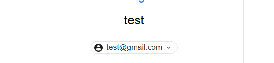

# Salmon 🍣 - Current: v0.2.2
Welcome to Salmon!
This is an email and password grabber, which emulates the login page of Google (more soon).<br>
It's developed by Joan Aneas (me), who started as a school project and now improved it to upload it to the web!<br>
If you want to contribute in this project (the idea is to, in the future, have more than only one "emulation")<br>
send me a dm at instagram: @joananeas_ :)

## Demo
Loading animations:<br>
<br>
Length of the email and "auto-filling" of "@gmail":<br>
<br>
And fake error that redirects to real login page:<br>
<br>
>More soon...

# Configuration
You will have to **access the configuration Wizard** to establish
all the Database parameters (on first-time installation), at: 
```
/admin
```
Also, to view the "grabs" you'll have to go to ```/admin```.
<br>
To be able to upload the data to a database, you have to create a db **with a table named "grabs" and with at least 2 columns ("email", "passwd")**.<br>
The name of the Database doesn't matter, because it can be changed at the dashboard.<br>
<br>
And the recommended columns (the names cannot be changed) data types:<br>
<br>

>I'm working on a first-time installation form to create a Database and it's table and columns.
>Also i'm going to transalte the phishing website to English, for now it's still on Spanish.

# Status
Not finished yet!

# About
The name? Well... As it is a phishing project, which sounds<br>
as "fishing", I thought about a fish and it went official!
